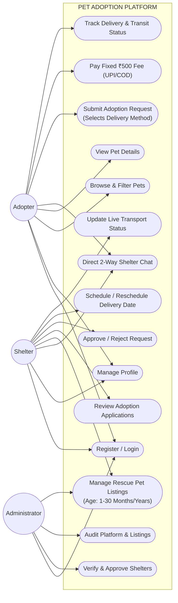
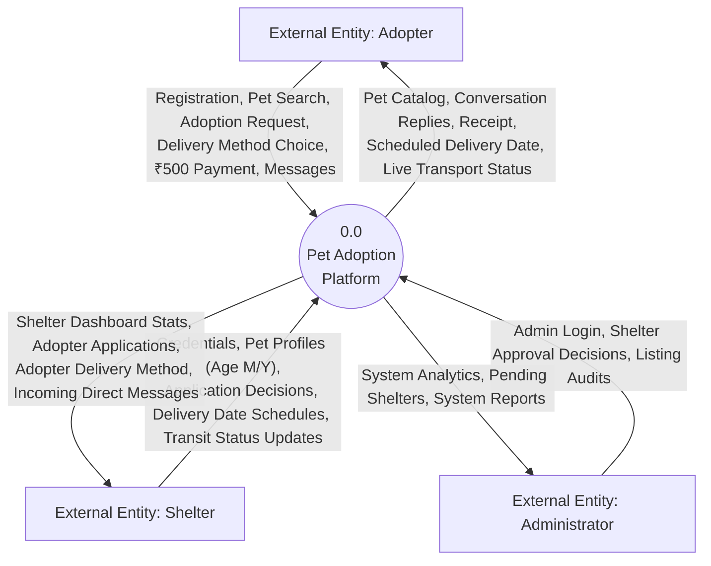
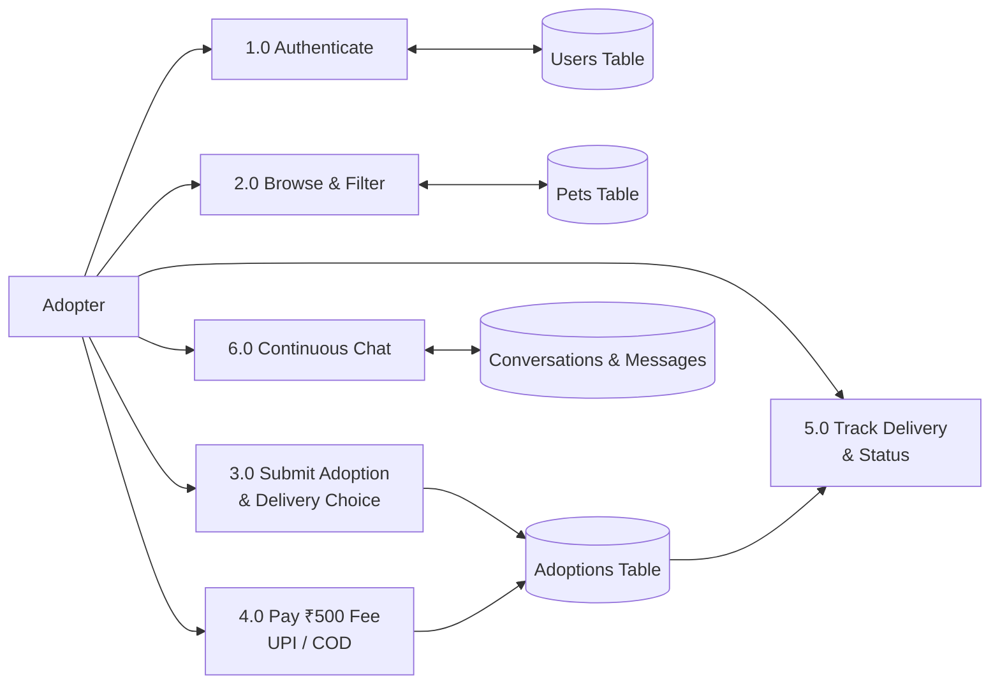
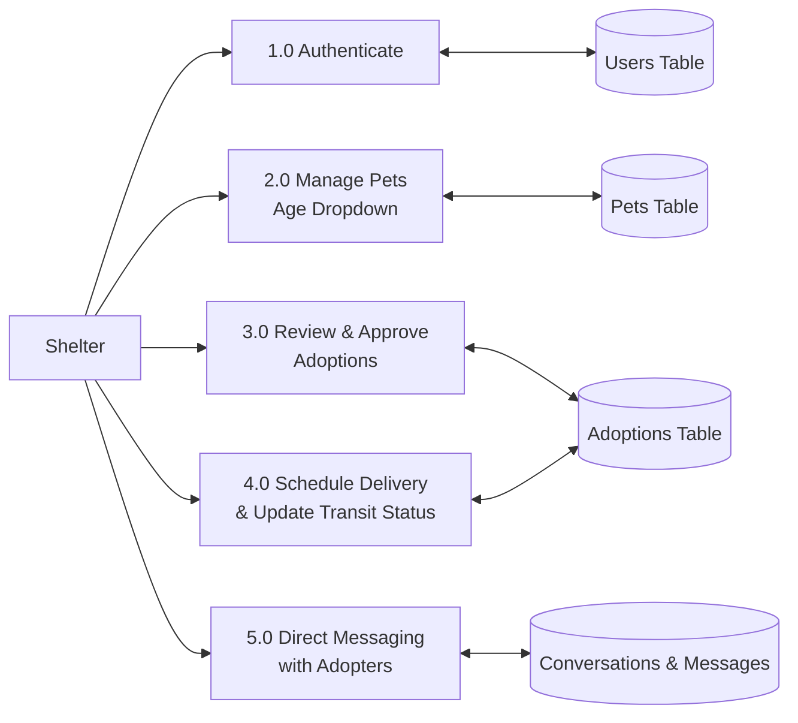
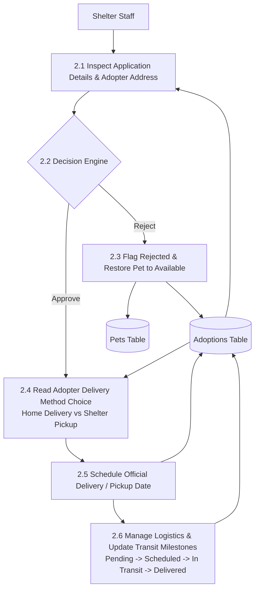
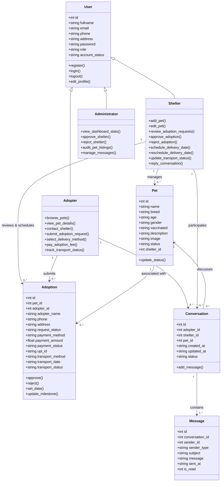
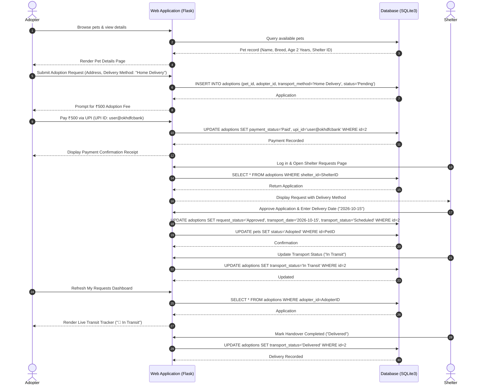
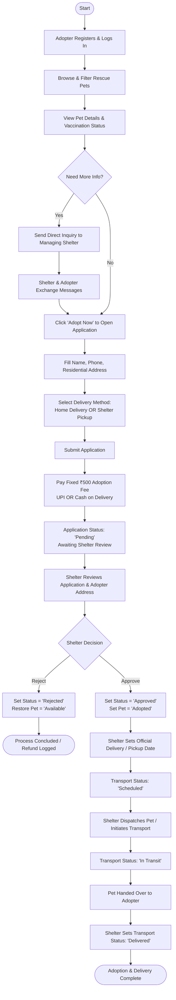

# PET ADOPTION PLATFORM

**A project report submitted in fulfillment of the requirements for the award of the degree of**  
### MASTER OF COMPUTER APPLICATIONS  
*From*  
**APJ Abdul Kalam Technological University**

**Submitted By:**  
**NAVEENA NOURIN K M (MEA25MCA-2018)**

**MEA Engineering College**  
**Department of Computer Applications**  
Vengoor P.O, Perinthalmanna, Malappuram, Kerala - 679325  
**OCTOBER 2026**

---

## DEPARTMENT OF COMPUTER APPLICATIONS  
### MEA ENGINEERING COLLEGE  
**PERINTHALMANNA - 679325**

### CERTIFICATE

This is to certify that the Project report entitled **"Pet Adoption Platform"** is a bonafide record of the work done by **NAVEENA NOURIN K M (MEA25MCA-2018)** under our supervision and guidance. The report has been submitted in fulfillment of the requirement for award of the Degree of *Master of Computer Applications* from the APJ Abdul Kalam Technological University for the year 2026.

\
\
**Mr. Adil Narakkoden**  
*Assistant Professor*  
*Project Guide*  
*Dept. of Computer Applications*

\
\
**Mr. Sajeesh M**  
*Assistant Professor*  
*Head of the Department*  
*Dept. of Computer Applications*

---

## ACKNOWLEDGEMENTS

First and foremost, I would like to thank Almighty God for giving me the knowledge and strength which helped me in the successful completion of this project.

An endeavor over a long period may be successful only with advice and guidance of many well wishers. I take this opportunity to express my gratitude to all who encouraged me to complete this project. I would like to express my deep sense of gratitude to our respected Principal **Dr. Shahir V K** for his inspiration and for creating an encouraging atmosphere in the college to do the project.

I would like to thank **Mr. Sajeesh M**, Assistant Professor and Head of the Department, for providing permission and facilities to conduct the project in a systematic way. I am highly indebted to **Mr. Adil Narakkoden**, Assistant Professor in the Department of Computer Applications, for guiding me and giving timely advice, suggestions, and wholehearted moral support in the successful completion of this project.

My sincere thanks to Project Co-ordinator **Mr. Adil Narakkoden**, Assistant Professor in Department of Computer Applications, for his continuous guidance throughout the duration of this project.

**NAVEENA NOURIN K M (MEA25MCA-2018)**  
**DATE:** OCTOBER 25, 2026

---

## ABSTRACT

The **Pet Adoption Platform** is a web-based application developed to facilitate and streamline the process of pet adoption by providing a centralized digital ecosystem for adopters, animal shelters, and administrators. Traditional pet adoption procedures often involve manual paperwork, fragmented communication across unverified channels, lack of accessibility to verified pet medical backgrounds, and unorganized post-adoption handover coordination. The proposed system addresses these challenges by providing an organized, transparent, and user-friendly digital platform where potential adopters can browse available rescued pets, review comprehensive profiles, communicate directly with the specific managing shelter through a continuous two-way messaging thread, submit adoption requests, and choose their preferred delivery method.

The application incorporates role-based access control supporting three primary categories of users: **Adopters**, **Shelters**, and **Administrators**. Adopters can create accounts, log in upon credential verification, search and filter pets based on categories (dogs, cats, rabbits), view detailed pet medical and vaccination histories, submit formal adoption applications with their choice of delivery method (*Home Delivery* or *Shelter Pickup*), complete a standardized flat adoption fee of **₹500** via UPI or Cash on Delivery (COD), and track real-time adoption and transport status.

In the platform's architecture, all pet delivery and transportation activities are managed directly by the **Shelter Module**, completely eliminating the need for an independent third-party transport provider. Animal shelters register with administrative vetting, maintain rescue pet profiles using a standardized age dropdown system (number 1 to 30 combined with units in Months or Years), review incoming adoption applications, engage in direct pet-specific conversations with applicants, approve or reject applications, view the adopter's immutable delivery method choice, schedule and reschedule handover/delivery dates, and update live transit milestones (*Pending*, *Scheduled*, *In Transit*, *Delivered*). Platform administrators oversee the ecosystem by reviewing and approving shelter registrations, monitoring adoption records, auditing pet listings, and managing general inquiries.

The system is implemented using **Python** with the **Flask** web framework for server-side business logic and **SQLite3** as the relational database management system. The responsive user interface is built using **HTML5**, **CSS3**, **Bootstrap 5**, and **JavaScript**. By integrating pet listings, continuous direct communication, transparent payment processing, and shelter-coordinated delivery management into a unified platform, the system enhances adoption rates, eliminates middleman overhead, and ensures safe, accountable pet placement.

---

## CONTENTS

1. **INTRODUCTION** ............................................................................ 1  
2. **SYSTEM ANALYSIS** ......................................................................... 3  
   2.1 Existing System ......................................................................... 4  
   2.2 Proposed System ......................................................................... 4  
   2.3 Module Description ...................................................................... 4  
   2.4 Sprint .................................................................................. 6  
3. **FEASIBILITY STUDY** ....................................................................... 8  
   3.1 Economical Feasibility .................................................................. 9  
   3.2 Technical Feasibility ................................................................... 9  
   3.3 Operational Feasibility ................................................................. 9  
   3.4 Behavioural Feasibility ................................................................. 9  
   3.5 Software Feasibility ................................................................... 10  
   3.6 Hardware Feasibility ................................................................... 10  
4. **SOFTWARE ENGINEERING PARADIGM** ........................................................... 11  
   4.1 Agile Model ............................................................................ 12  
   4.2 Scrum .................................................................................. 12  
5. **SYSTEM REQUIREMENTS SPECIFICATION** ....................................................... 13  
   5.1 Software Requirements .................................................................. 14  
   5.2 Hardware Requirements .................................................................. 14  
6. **SYSTEM DESIGN** ........................................................................... 15  
   6.1 Database Design & Normalization (1NF, 2NF, 3NF) ........................................ 16  
   6.2 Tables & Data Dictionary ............................................................... 18  
   6.3 UML Design ............................................................................. 20  
   6.4 User Story ............................................................................. 21  
   6.5 Use Case Diagram ....................................................................... 22  
   6.6 User Interaction Scenarios ............................................................. 24  
   6.7 Data Flow Diagrams (Context Level 0, Level 1, Level 2) ................................. 26  
   6.8 System Architecture Diagram ............................................................ 30  
   6.9 Class Diagram .......................................................................... 31  
   6.10 Sequence Diagram ...................................................................... 32  
   6.11 Activity Diagram ...................................................................... 33  
7. **SYSTEM DEVELOPMENT** ..................................................................... 34  
   7.1 Coding Technologies .................................................................... 35  
8. **SYSTEM TESTING AND IMPLEMENTATION** ...................................................... 38  
   8.1 Types of Testing & Verification Results ................................................. 39  
   8.2 Implementation Activities .............................................................. 41  
9. **SYSTEM MAINTENANCE** ...................................................................... 42  
10. **FUTURE ENHANCEMENT** .................................................................... 44  
11. **CONCLUSION** ............................................................................ 46  
12. **APPENDIX** .............................................................................. 47  
13. **BIBLIOGRAPHY** .......................................................................... 53  

---

# 1. INTRODUCTION

Pet adoption is an essential humanitarian process that provides homeless, abandoned, and rescued animals with loving, permanent homes while assisting individuals and families in finding healthy companion animals. In traditional pet adoption environments, procedures heavily depend on physical visits to dispersed shelters, manual paper forms, phone calls, and uncoordinated social media postings. These legacy methods introduce significant delays, communication breakdowns, and geographical barriers. Potential adopters struggle to discover up-to-date pet information, verify vaccination records, or track the progress of their applications. Concurrently, animal shelters operate with limited administrative resources, manually sifting through applications, fielding repetitive inquiries, and struggling to coordinate the safe logistics of pet handovers.

To overcome these inefficiencies, the **Pet Adoption Platform** was designed and implemented as an integrated web application that unifies and automates the complete pet adoption lifecycle. The platform establishes a centralized digital environment where verified animal shelters can showcase adoptable pets with rich multimedia profiles, detailed descriptions, vaccination records, and standardized age information. Prospective adopters can browse listings, apply category and breed filters, initiate direct conversations with the specific shelter responsible for a pet, submit formal adoption requests, and select their preferred delivery method.

A foundational architectural principle of the Pet Adoption Platform is the **consolidation of pet delivery and transportation management directly under the Shelter Module**. Unlike commercial e-commerce systems that delegate logistics to third-party shipping couriers, animal welfare logistics demand strict accountability, specialized animal care, and direct oversight by the rescue organization itself. In this platform, there is no separate Transport Provider module or external transport actor. Instead, the shelter that rescues and cares for the animal directly manages the delivery process: reviewing the adopter's chosen delivery method (*Home Delivery* or *Shelter Pickup*), coordinating dates, scheduling and rescheduling handover timelines, and updating live transit milestones (*Pending*, *Scheduled*, *In Transit*, *Delivered*).

The platform enforces role-based access control for three distinct actors:
1. **Adopters**: Can register, search and inspect adoptable animals, engage in continuous two-way messaging with specific shelters, apply for pet adoptions, choose delivery preferences, complete a transparent flat adoption fee of **₹500** via UPI or Cash on Delivery (COD), and track application and transit status in real time.
2. **Shelters**: Register with administrative review, maintain detailed pet profiles with standardized age controls (Months/Years, strictly non-zero), respond to adopter inquiries in private conversation threads, review adoption applications, approve or reject requests, schedule and reschedule delivery dates, and manage transport statuses.
3. **Administrators**: Oversee overall platform governance, verify and approve new shelter registrations, audit pet listings, monitor adoption records, and maintain platform communication integrity.

By combining pet discovery, targeted shelter-adopter communication, transparent fixed-fee adoption processing, and direct shelter-managed delivery logistics into a cohesive software architecture, the Pet Adoption Platform eliminates manual overhead, improves operational transparency, and promotes higher rates of successful, ethical pet adoptions.

---

# 2. SYSTEM ANALYSIS

System analysis involves a detailed study of the operational challenges inherent in manual adoption methods and defines the functional and technical specifications required to deliver an automated, reliable software solution.

### 2.1 Existing System
In the traditional and legacy pet adoption ecosystem, operations are fragmented and unorganized:
- **Manual Communication & Physical Visits**: Adopters must physically travel to individual animal shelters or rely on unverified social media listings, leading to wasted time and limited visibility into adoptable animals across regions.
- **Paper-Based Record Keeping**: Shelters record animal intake, medical backgrounds, and adoption applications in paper files or disconnected spreadsheets, making records vulnerable to loss, duplication, and human error.
- **Unstructured Inquiries**: Prospective adopters send generic inquiries through disparate channels (phone, email, social messaging), leading to lost messages and delayed responses.
- **Lack of Delivery Coordination**: Traditional shelters either require adopters to arrange personal pickup without scheduling tools or rely on informal third-party transport arrangements that lack status visibility, date tracking, and safety accountability.
- **Arbitrary Pricing & Unclear Payment Handling**: Adoption fees vary arbitrarily and lack standardized receipt tracking, deterring potential adopters.

### 2.2 Proposed System
The proposed **Pet Adoption Platform** introduces an automated, centralized web-based solution that digitizes every stage of the pet adoption workflow:
- **Centralized Pet Catalog**: Real-time searchable and filterable database of rescued pets categorized by species (dogs, cats, rabbits), breed, gender, vaccination state, and standardized age.
- **Direct Two-Way Messaging Thread**: Built-in conversation system linking the adopter, the specific managing shelter, and the relevant pet, supporting continuous multi-message dialogue.
- **Standardized Adoption Processing**: Structured adoption application capturing adopter living address, contact information, and delivery preference.
- **Fixed & Transparent Fee**: Standardized flat adoption fee of **₹500** with integrated UPI ID validation and Cash on Delivery (COD) options.
- **Shelter-Managed Delivery Coordination**: The Shelter oversees the entire delivery lifecycle. The adopter's selected delivery method (*Home Delivery* or *Shelter Pickup*) remains locked, while the shelter sets the scheduled date, reschedules when necessary, and updates live transit milestones (*Pending*, *Scheduled*, *In Transit*, *Delivered*).
- **Administrative Governance**: Dedicated administrative portal to verify shelter authenticity, audit pet listings, and ensure ethical adoption practices.

```
ADOPTER WORKFLOW:
Browse Pets ──> View Details ──> Contact Shelter ──> Multi-Message Conversation
                                         │
Submit Adoption Request (Selects Delivery: Home Delivery / Shelter Pickup)
                                         │
Pay ₹500 Adoption Fee (UPI / Cash on Delivery)
                                         │
SHELTER WORKFLOW:
Review Request ──> Approve Request ──> Schedule Delivery Date
                                                │
                                       Update Transport Milestones
                               (Pending -> Scheduled -> In Transit -> Delivered)
                                                │
                                    Adopter Receives Pet Handover
```

---

### 2.3 Module Description

The platform is structured into **three primary role modules** supported by **five specialized core services**:

```
+---------------------------------------------------------------------------------------+
|                               PET ADOPTION PLATFORM                                   |
+--------------------------+----------------------------+-------------------------------+
|    1. ADOPTER MODULE     |     2. SHELTER MODULE      |     3. ADMIN MODULE           |
|    - User Authentication |     - Shelter Dashboard    |     - Shelter Verification    |
|    - Catalog & Filtering |     - Rescue Profile Mgmt  |     - Pet Listing Oversight   |
|    - Adoption Inquiries  |     - Application Review   |     - Adoption Auditing       |
|    - Request & Tracking  |     - Direct Conversations |     - Platform Messaging      |
+--------------------------+----------------------------+-------------------------------+
|                                  CORE SERVICES                                        |
+--------------------------+----------------------------+-------------------------------+
| 4. PET MANAGEMENT        | 5. ADOPTION MANAGEMENT     | 6. PAYMENT MANAGEMENT         |
| - Photo & Metadata Specs | - Review & Decision Engine | - Flat ₹500 Adoption Fee      |
| - Age (Number + Unit)    | - Approval / Rejection     | - UPI Validation & COD        |
+--------------------------+----------------------------+-------------------------------+
| 7. DELIVERY & TRANSPORT (UNDER SHELTER)               | 8. CONVERSATION & MESSAGING   |
| - Adopter Delivery Selection (Locked)                 | - Continuous 2-Way Chat Thread|
| - Shelter Date Scheduling & Rescheduling              | - Adopter <-> Shelter <-> Pet |
| - Live Milestones (Pending -> Delivered)              | - Specific Shelter Inboxes    |
+-------------------------------------------------------+-------------------------------+
```

#### 1. Adopter Module
- **Registration & Authentication**: Secure sign-up and login with password hashing and session management.
- **Pet Discovery & Search**: Keyword search across pet names and breeds; dynamic category filtering (Dogs, Cats, Rabbits, etc.).
- **Pet Profile View**: High-resolution image viewing, detailed behavioral descriptions, vaccination status, and standardized age display.
- **Application Submission**: Structured adoption request submission capturing applicant name, phone, residential address, and preferred delivery method.
- **Adoption Tracking & History**: Adopter dashboard displaying real-time application status, scheduled delivery dates, and live transit milestones.
- **Direct Shelter Communication**: Initiating and maintaining two-way chat threads with the specific shelter managing the pet.

#### 2. Shelter Module
*(Consolidates pet care, adoption management, continuous communication, and delivery operations)*
- **Shelter Authentication & Profile**: Secure login with administrative approval gating; organization profile management (operating address, phone number, credentials).
- **Shelter Dashboard**: Real-time overview of rescue statistics (total pets listed, available pets, adopted animals, pending applications).
- **Application Review Pipeline**: Reviewing incoming adoption applications, inspecting applicant details and delivery preference, with the authority to approve or reject.
- **Delivery Date Scheduling**: Upon approving an adoption request, the shelter assigns an official scheduled delivery or pickup date.
- **Delivery Rescheduling**: Capability to adjust or reschedule delivery dates in response to logistical requirements.
- **Live Transport Status Updates**: Advancing delivery milestones through validated transitions: `Pending` → `Scheduled` → `In Transit` → `Delivered`.
- **Direct Adopter Messaging**: Managing dedicated conversation threads with applicants to evaluate adoption suitability.

#### 3. Administrator Module
- **System Dashboard**: High-level platform metrics covering total registered adopters, registered shelters, listed pets, and adoption volume.
- **Shelter Verification**: Reviewing and approving or rejecting shelter registration applications to ensure only legitimate animal welfare organizations participate.
- **Pet Listing Oversight**: Auditing pet records, editing listings where necessary, and monitoring availability statuses.
- **Adoption Monitoring**: Oversight over all platform adoption transactions and payment records.
- **Platform Inquiries**: Managing general platform contact messages submitted by visitors.

#### 4. Pet Management Service
- Captures and validates pet metadata: Pet Name, Breed, Gender (Male/Female), Vaccination Status (Yes/No), Description, Image, Availability Status (*Available* vs *Adopted*), and Shelter Association (`shelter_id`).
- **Standardized Age System**: Replaces free-text input with a dual-input dropdown:
  - **Number**: Integers from **1 to 30** (strictly non-zero and non-negative).
  - **Unit**: **Months** or **Years**.
  - Enforces uniform database storage and display (e.g., "1 Month", "6 Months", "2 Years").

#### 5. Adoption Management Service
- Connects prospective adopters with specific pets and managing shelters.
- Manages the adoption request lifecycle:
  - `Pending`: Application submitted, awaiting shelter review.
  - `Approved`: Application approved by shelter; pet availability updated to *Adopted*; delivery scheduling unlocked.
  - `Rejected`: Application declined; pet restored to *Available*; refund logged if pre-paid.

#### 6. Payment Management Service
- Strictly enforces a transparent, non-negotiable **flat adoption fee of ₹500** per adopted pet.
- Supported payment methods:
  - **UPI**: Validated UPI Virtual Payment Address (e.g., `user@upi`, `name@okhdfcbank`), transaction timestamp logging, and printable payment confirmation card generation.
  - **Cash on Delivery (COD)**: Handover payment recorded for settlement upon physical pet delivery.

#### 7. Delivery / Transport Management (Functionality Under Shelter Module)
- **Adopter Selection (Immutable)**: The adopter selects *Home Delivery* or *Shelter Pickup* during request submission. The shelter cannot alter this choice.
- **Shelter Date Scheduling**: The shelter selects and confirms the delivery/handover date.
- **Shelter Date Rescheduling**: The shelter can reschedule the delivery date with automated date validation.
- **Live Transit Milestones**:
  - `Pending`: Initial request state prior to shelter review.
  - `Scheduled`: Delivery date established by the shelter.
  - `In Transit`: Pet dispatched for home delivery or en route.
  - `Delivered`: Pet successfully received by the adopter.
- **Real-Time Adopter Visibility**: Adopters track live delivery status directly from their dashboard without third-party courier accounts.

#### 8. Communication / Conversation Module
- **Direct Shelter Thread**: When an adopter clicks "Contact Shelter" on a pet listing, the message is routed exclusively to the shelter that owns that pet.
- **Continuous Two-Way Messaging**: Supports ongoing, back-and-forth dialogue (`Adopter → Shelter → Adopter → Shelter...`) with no limit on the number of messages.
- **Thread Continuity**: All messages regarding a specific pet and adopter pair are maintained under a persistent `conversation_id`.
- **No Shared Inbox**: Messages are isolated per shelter; shelters only view conversations relevant to their own rescue animals.

---

### 2.4 Sprint Plan

The project was executed following the **Agile Scrum** methodology across **4 structured Sprints**:

#### Sprint 1: Adopter Portal & Pet Catalog
| Task | Pending Task | Hours | Expected Date | Actual Date | Reason for Delay |
| :--- | :---: | :---: | :---: | :---: | :---: |
| Adopter Registration & Auth | - | 2 hr | 15/07/2026 | 15/07/2026 | - |
| Adopter Login & Session Mgmt | - | 2 hr | 17/07/2026 | 17/07/2026 | - |
| Pet Listing Catalog & Category Filters | - | 3 hr | 18/07/2026 | 18/07/2026 | - |
| Pet Details View & Full Image Display | - | 2 hr | 21/07/2026 | 21/07/2026 | - |
| Adoption Request Form (Delivery Option) | - | 3 hr | 22/07/2026 | 22/07/2026 | - |

#### Sprint 2: Shelter Operations & Pet Lifecycle
| Task | Pending Task | Hours | Expected Date | Actual Date | Reason for Delay |
| :--- | :---: | :---: | :---: | :---: | :---: |
| Shelter Registration & Profile Setup | - | 2 hr | 30/07/2026 | 30/07/2026 | - |
| Shelter Authentication & Dashboard | - | 2 hr | 01/08/2026 | 01/08/2026 | - |
| Pet Management (Age Dropdown 1-30) | - | 3 hr | 07/08/2026 | 07/08/2026 | - |
| Application Review Pipeline | - | 3 hr | 15/08/2026 | 15/08/2026 | - |
| Application Approve / Reject Decisions | - | 2 hr | 17/08/2026 | 17/08/2026 | - |

#### Sprint 3: Administrative Governance & Audit
| Task | Pending Task | Hours | Expected Date | Actual Date | Reason for Delay |
| :--- | :---: | :---: | :---: | :---: | :---: |
| Admin Authentication & Dashboard | - | 2 hr | 20/08/2026 | 20/08/2026 | - |
| Shelter Verification & Approval System | - | 2 hr | 25/08/2026 | 25/08/2026 | - |
| User Account Management | - | 2 hr | 24/08/2026 | 24/08/2026 | - |
| Pet Listing Audit & Moderation | - | 3 hr | 27/08/2026 | 27/08/2026 | - |
| System Inquiries & Activity Monitoring | - | 2 hr | 29/08/2026 | 29/08/2026 | - |

#### Sprint 4: Shelter Delivery Coordination & Communication Integration
| Task | Pending Task | Hours | Expected Date | Actual Date | Reason for Delay |
| :--- | :---: | :---: | :---: | :---: | :---: |
| Continuous Two-Way Messaging Thread | - | 3 hr | 05/09/2026 | 05/09/2026 | - |
| Specific Shelter Message Inboxes | - | 2 hr | 08/09/2026 | 08/09/2026 | - |
| Fixed ₹500 Payment Integration (UPI/COD) | - | 2 hr | 12/09/2026 | 12/09/2026 | - |
| Shelter Delivery Scheduling Interface | - | 2 hr | 16/09/2026 | 16/09/2026 | - |
| Shelter Transit Milestone Updates | - | 2 hr | 20/09/2026 | 20/09/2026 | - |
| Adopter Live Tracking Dashboard | - | 2 hr | 24/09/2026 | 24/09/2026 | - |

---

# 3. FEASIBILITY STUDY

A feasibility study assesses the operational, economic, technical, and behavioral viability of the project before full-scale deployment.

### 3.1 Economical Feasibility
The platform is economically feasible because it relies entirely on open-source, zero-licensing technologies: Python, Flask, SQLite, HTML5, CSS3, Bootstrap 5, and JavaScript. Development required no proprietary software licenses. Furthermore, by delegating pet transport scheduling directly to animal shelters rather than introducing third-party logistics aggregators, operational costs are minimized. The fixed ₹500 adoption fee covers basic vaccination and shelter administrative handling without inflating expenses.

### 3.2 Technical Feasibility
The application is technically sound and easily maintainable. Flask is a mature, lightweight microframework capable of handling routing, session security, and template rendering efficiently. SQLite provides zero-configuration ACID-compliant relational data storage embedded directly within the application file structure. Bootstrap 5 guarantees fluid responsiveness across mobile, tablet, and desktop devices. The development team possessed the required proficiency in Python web development, database normalization, and frontend styling.

### 3.3 Operational Feasibility
The platform is operationally viable as it aligns with the daily workflows of animal shelters. Shelters already evaluate applicants and arrange animal transfers; providing them with digital tools to schedule dates and publish transit milestones eliminates phone tag and chaotic paperwork. Adopters benefit from self-service pet discovery, clear pricing, and live status visibility.

### 3.4 Behavioural Feasibility
The user interface is designed with high visual clarity, intuitive navigation bars, distinct status badges, and clear action buttons. Users require no specialized training. Form inputs include built-in validation (e.g., pet age selection via dropdowns, 10-digit phone enforcement), preventing common data entry mistakes and encouraging broad adoption.

### 3.5 Software Feasibility
The application runs across modern web browsers (Google Chrome, Mozilla Firefox, Microsoft Edge, Safari) and can be hosted on standard Linux or Windows web servers running Python 3.10+. Open-source libraries ensure long-term supportability without vendor lock-in.

### 3.6 Hardware Feasibility
The platform requires only standard computing hardware: a server with at least 1 GB RAM and 1 CPU core is sufficient to handle hundreds of concurrent users. End-users can access all features using standard laptops, desktop computers, or smartphones connected to the internet.

---

# 4. SOFTWARE ENGINEERING PARADIGM

### 4.1 Agile Model
The Pet Adoption Platform was engineered using the **Agile Software Development Life Cycle (SDLC)** model. Agile prioritizes iterative delivery, stakeholder collaboration, and rapid adaptability to evolving functional requirements. Development was broken into short, incremental builds that delivered functional software at each iteration. This enabled continuous feedback, early identification of usability bottlenecks (such as transitioning pet age input from free text to structured dropdowns), and architectural streamlining (such as consolidating transport coordination directly into the Shelter module).

### 4.2 Scrum Framework
Scrum was selected as the specific Agile operational framework. Work was structured into four time-boxed **Sprints** of approximately two weeks each:
- **Sprint Backlog**: User stories were prioritized and decomposed into actionable development tasks.
- **Daily Scrums**: Brief progress reviews to inspect completed tasks, identify blockers, and coordinate next steps.
- **Sprint Review & Retrospectives**: At the conclusion of each sprint, working software increments were tested and evaluated, allowing immediate architectural adjustments.

---

# 5. SYSTEM REQUIREMENTS SPECIFICATION (SRS)

### 5.1 Software Requirements
| Component | Specification |
| :--- | :--- |
| **Operating System** | Windows 10/11, Ubuntu 20.04+ Linux, or macOS |
| **Programming Language** | Python 3.10 or above |
| **Web Framework** | Flask 2.3+ |
| **Database Engine** | SQLite3 |
| **Frontend Technologies** | HTML5, CSS3, JavaScript (ES6+), Bootstrap 5.3 |
| **Development Environment** | Visual Studio Code / PyCharm |
| **Supported Browsers** | Google Chrome, Mozilla Firefox, Microsoft Edge |

### 5.2 Hardware Requirements
| Component | Minimum Specification | Recommended Specification |
| :--- | :--- | :--- |
| **Processor** | Intel Core i3 / AMD Ryzen 3 | Intel Core i5 / AMD Ryzen 5 or above |
| **System Memory (RAM)**| 4 GB | 8 GB or above |
| **Storage Capacity** | 20 GB available disk space | 50 GB SSD storage |
| **Display Resolution** | 1366 × 768 pixels | 1920 × 1080 pixels (Full HD) |
| **Peripherals** | Standard keyboard, mouse | Standard keyboard, mouse |
| **Network Interface** | Standard Broadband / Wi-Fi | High-speed Internet connection |

---

# 6. SYSTEM DESIGN

System design translates the functional requirements into technical architectures, relational database schemas, and object-oriented modeling diagrams.

### 6.1 Database Design & Normalization

The relational schema was normalized following rigorous database design principles to eliminate data redundancy and prevent insertion, update, and deletion anomalies.

#### 1. First Normal Form (1NF)
A relation is in 1NF if all column values are atomic (indivisible) and there are no repeating groups.
- All attributes in `users`, `pets`, `adoptions`, `conversations`, and `messages` hold single scalar values.
- Pet age, previously susceptible to non-atomic strings, is standardized as a single validated string constructed from atomic integer and unit values (e.g., "2 Years", "6 Months").
- Primary keys (`id`) uniquely identify every record in each table.

#### 2. Second Normal Form (2NF)
A relation is in 2NF if it satisfies 1NF and all non-key attributes are fully functionally dependent on the entire primary key (no partial dependencies on composite keys).
- Every table utilizes a single-attribute surrogate primary key (`INTEGER PRIMARY KEY AUTOINCREMENT`).
- Consequently, partial key dependencies are mathematically impossible, satisfying 2NF across all entities.

#### 3. Third Normal Form (3NF)
A relation is in 3NF if it is in 2NF and contains no transitive dependencies (no non-key attribute depends on another non-key attribute).
- In `pets`, all attributes (`name`, `breed`, `age`, `gender`, `vaccinated`, `description`, `image`, `status`) depend strictly on `pets.id`. Shelter details are referenced exclusively via foreign key `shelter_id` pointing to `users.id`, preventing duplication of shelter organization attributes.
- In `adoptions`, adoption transaction attributes depend strictly on `adoptions.id`. Pet details are referenced via foreign key `pet_id`, and adopter credentials via `adopter_id`. Delivery scheduling dates and status attributes depend directly on the adoption record.
- In `conversations` and `messages`, conversation tracking is separated from individual message records. `conversations` tracks the persistent thread between adopter, shelter, and pet, while `messages` stores individual timestamped messages linked via `conversation_id`.

---

### 6.2 Database Tables & Data Dictionary

#### 1. `users` Table
Stores authentication credentials, contact details, and system roles for all platform participants.

| Column Name | Data Type | Constraints | Description |
| :--- | :--- | :--- | :--- |
| `id` | INTEGER | PRIMARY KEY, AUTOINCREMENT | Unique user identifier |
| `fullname` | TEXT | NOT NULL | User's full name or shelter organization name |
| `email` | TEXT | UNIQUE, NOT NULL | Account email address used for login |
| `phone` | TEXT | NOT NULL | 10-digit mobile contact number |
| `address` | TEXT | NOT NULL | Street address or shelter facility location |
| `password` | TEXT | NOT NULL | User account password |
| `role` | TEXT | DEFAULT 'Adopter' | System role: `'Adopter'`, `'Shelter'`, or `'Admin'` |
| `account_status` | TEXT | DEFAULT 'Pending' | Account verification: `'Pending'`, `'Approved'`, `'Rejected'` |

#### 2. `pets` Table
Maintains catalog records for all rescue animals listed by verified shelters.

| Column Name | Data Type | Constraints | Description |
| :--- | :--- | :--- | :--- |
| `id` | INTEGER | PRIMARY KEY, AUTOINCREMENT | Unique pet identifier |
| `name` | TEXT | NOT NULL | Animal's name |
| `breed` | TEXT | NOT NULL | Specific animal breed (e.g., Labrador, Persian) |
| `age` | TEXT | NOT NULL | Standardized age (e.g., "2 Years", "6 Months") |
| `gender` | TEXT | NOT NULL | Animal gender (`'Male'`, `'Female'`) |
| `vaccinated` | TEXT | NOT NULL | Vaccination status (`'Yes'`, `'No'`) |
| `description` | TEXT | NOT NULL | Health and behavioral description |
| `image` | TEXT | NOT NULL | File path to pet photograph |
| `status` | TEXT | DEFAULT 'Available' | Adoption availability (`'Available'`, `'Adopted'`) |
| `shelter_id` | INTEGER | FOREIGN KEY (`users.id`) | Reference to managing shelter user record |

#### 3. `adoptions` Table
Stores formal adoption applications, delivery preferences, payment records, and shelter delivery management data.

| Column Name | Data Type | Constraints | Description |
| :--- | :--- | :--- | :--- |
| `id` | INTEGER | PRIMARY KEY, AUTOINCREMENT | Unique adoption application identifier |
| `pet_id` | INTEGER | FOREIGN KEY (`pets.id`) | Reference to adopted pet |
| `adopter_id` | INTEGER | FOREIGN KEY (`users.id`) | Reference to applicant user record |
| `adopter_name`| TEXT | NOT NULL | Applicant full name |
| `phone` | TEXT | NOT NULL | Contact telephone number |
| `address` | TEXT | NOT NULL | Delivery destination address |
| `request_status`| TEXT | DEFAULT 'Pending' | Decision state: `'Pending'`, `'Approved'`, `'Rejected'` |
| `payment_method`| TEXT | DEFAULT 'Online' | Chosen payment method: `'UPI'`, `'COD'` |
| `payment_amount`| REAL | DEFAULT 500.0 | Fixed adoption fee strictly enforced at ₹500 |
| `payment_status`| TEXT | DEFAULT 'Pending' | Payment verification: `'Pending'`, `'Paid'`, `'COD'` |
| `upi_id` | TEXT | NULLABLE | Adopter's UPI ID (e.g., `user@upi`) when paid via UPI |
| `payment_date`| TEXT | NULLABLE | Timestamp of completed payment |
| `request_date`| TEXT | DEFAULT (date('now')) | Date application was submitted |
| `transport_method`| TEXT | NOT NULL | Adopter's chosen delivery: `'Home Delivery'`, `'Shelter Pickup'` |
| `transport_date` | TEXT | NULLABLE | Handover/delivery date scheduled by shelter |
| `transport_status`| TEXT | DEFAULT 'Not Scheduled'| Delivery milestone: `'Pending'`, `'Scheduled'`, `'In Transit'`, `'Delivered'` |
| `refund_status` | TEXT | DEFAULT 'Not Applicable'| Refund state if pre-paid application is rejected |

#### 4. `conversations` Table
Tracks ongoing two-way communication threads between specific adopters and specific shelters regarding a pet.

| Column Name | Data Type | Constraints | Description |
| :--- | :--- | :--- | :--- |
| `id` | INTEGER | PRIMARY KEY, AUTOINCREMENT | Unique conversation thread identifier |
| `adopter_id` | INTEGER | NOT NULL, FOREIGN KEY (`users.id`) | Reference to prospective adopter |
| `shelter_id` | INTEGER | NOT NULL, FOREIGN KEY (`users.id`) | Reference to managing shelter |
| `pet_id` | INTEGER | FOREIGN KEY (`pets.id`) | Reference to discussed pet listing |
| `created_at` | TEXT | NOT NULL | Thread creation timestamp |
| `updated_at` | TEXT | NOT NULL | Timestamp of most recent message |
| `status` | TEXT | DEFAULT 'Open' | Thread status (`'Open'`, `'Closed'`) |

#### 5. `messages` Table
Stores individual messages belonging to continuous conversation threads.

| Column Name | Data Type | Constraints | Description |
| :--- | :--- | :--- | :--- |
| `id` | INTEGER | PRIMARY KEY, AUTOINCREMENT | Unique message identifier |
| `conversation_id` | INTEGER | FOREIGN KEY (`conversations.id`) | Reference to parent conversation thread |
| `user_id` | INTEGER | FOREIGN KEY (`users.id`) | Adopter account reference |
| `sender_id` | INTEGER | FOREIGN KEY (`users.id`) | ID of user sending this specific message |
| `sender_type` | TEXT | NOT NULL | Sender category: `'Adopter'` or `'Shelter'` |
| `shelter_id` | INTEGER | FOREIGN KEY (`users.id`) | Destination/managing shelter reference |
| `pet_id` | INTEGER | FOREIGN KEY (`pets.id`) | Referenced pet listing |
| `name` | TEXT | NOT NULL | Sender's display name |
| `email` | TEXT | NOT NULL | Sender's email address |
| `subject` | TEXT | NOT NULL | Subject header |
| `message` | TEXT | NOT NULL | Message body text |
| `status` | TEXT | DEFAULT 'Unread' | Read state (`'Unread'`, `'Read'`) |
| `reply` | TEXT | NULLABLE | Inline reply snippet |
| `created_at` | TEXT | NOT NULL | Message submission timestamp |
| `sent_at` | TEXT | NOT NULL | Formatted time string |
| `is_read` | INTEGER | DEFAULT 0 | Binary read flag (`0` = unread, `1` = read) |

---

### 6.3 UML Designs
Unified Modeling Language (UML) provides standard structural and behavioral diagrams to visualize system components, actor interactions, and operational sequences.

The UML diagrams developed for the Pet Adoption Platform include:
1. **Use Case Diagram**: Captures interactions between the three system actors (Adopter, Shelter, Administrator) and system functionalities.
2. **Class Diagram**: Illustrates the object model, attributes, operations, and entity relationships.
3. **Sequence Diagram**: Traces chronological message exchanges across system boundaries during adoption and delivery scheduling.
4. **Activity Diagram**: Models the step-by-step decision workflows across the adoption lifecycle.

---

### 6.4 User Stories

- **Adopter User Story**:  
  *"As an adopter, I want to securely register and log in so that I can browse available rescue pets, filter by species, and inspect comprehensive vaccination profiles. I want to contact the specific shelter to ask questions in a continuous two-way conversation thread. When ready, I want to submit an adoption application selecting my preferred delivery method (Home Delivery or Shelter Pickup) and pay the fixed ₹500 fee via UPI or COD. Once approved, I want to view the delivery date scheduled by the shelter and track the live transit status until my pet arrives."*

- **Shelter User Story**:  
  *"As an animal shelter, I want to register and access a dedicated shelter dashboard after administrator verification. I want to add, edit, and manage pet listings using standardized age controls (Months/Years) and monitor availability. I want to receive adoption inquiries directly in my shelter inbox and converse with applicants. When an adoption request arrives, I want to review applicant details, inspect their chosen delivery method, approve or reject the request, set and reschedule delivery dates, and update live transit statuses (Pending, Scheduled, In Transit, Delivered) to complete handovers safely."*

- **Administrator User Story**:  
  *"As a platform administrator, I want to log in to an executive management dashboard to audit registered users, review and approve legitimate shelter registrations, moderate pet listings, monitor adoption volumes, and respond to general platform inquiries to ensure safety and ethical adoption standards."*

- **System Story**:  
  *"As the Pet Adoption System, I want to enforce role-based authorization, guarantee that pet delivery methods selected by adopters remain immutable, prevent invalid pet age entries, enforce a strict ₹500 adoption fee, maintain referential integrity across conversations and adoption records, and provide real-time status updates across all user interfaces."*

---

### 6.5 Use Case Diagram

The use case model defines system boundaries and actor associations. The system contains **three actors**: **Adopter**, **Shelter**, and **Administrator**. **There is no separate Transport Provider actor.** All logistics, delivery scheduling, and transport status operations are associated directly with the Shelter actor.



#### Actor Association Matrix
| Use Case | Adopter | Shelter | Administrator |
| :--- | :---: | :---: | :---: |
| Register / Login | ✓ | ✓ | ✓ |
| Manage Profile & Credentials | ✓ | ✓ | ✓ |
| Search & Browse Pet Listings | ✓ | - | ✓ |
| View Pet Details & Medicals | ✓ | ✓ | ✓ |
| Direct 2-Way Messaging Thread | ✓ | ✓ | - |
| Submit Adoption Request (Choose Delivery) | ✓ | - | - |
| Pay ₹500 Adoption Fee (UPI / COD) | ✓ | - | - |
| View Scheduled Date & Track Status | ✓ | - | - |
| Manage Pet Listings (Age 1-30 M/Y) | - | ✓ | ✓ |
| Review Adoption Applications | - | ✓ | ✓ |
| Approve / Reject Adoption Request | - | ✓ | - |
| Schedule & Reschedule Delivery Date | - | ✓ | - |
| Update Live Transport Status | - | ✓ | - |
| Verify & Approve Shelters | - | - | ✓ |
| Audit Platform Activity & Records | - | - | ✓ |

---

### 6.6 User Interaction Scenarios

#### 1. Adopter Interaction Scenario
1. **Account Setup**: Adopter registers with personal contact credentials and logs in.
2. **Discovery**: Adopter browses pet listings, applies category filters (Dog, Cat, Rabbit), and views pet profiles.
3. **Inquiry**: Adopter clicks "Contact Shelter", initiating a private two-way conversation with the shelter managing the selected pet.
4. **Application**: Adopter submits a formal adoption request, entering residential details and selecting either *Home Delivery* or *Shelter Pickup*.
5. **Payment**: Adopter completes the mandatory fixed ₹500 fee by entering their UPI ID or selecting Cash on Delivery (COD).
6. **Tracking**: Adopter monitors their dashboard to view application approval, scheduled delivery date, and live transit milestones.

#### 2. Shelter Interaction Scenario
1. **Registration**: Shelter registers with organization details and awaits administrator approval.
2. **Pet Management**: Shelter logs in to the Shelter Dashboard and adds rescue animals, specifying name, breed, standardized age (e.g., 2 Years), vaccination status, description, and photo.
3. **Communication**: Shelter accesses the Shelter Inbox to view messages from adopters and replies in an ongoing two-way conversation thread.
4. **Application Review**: Shelter reviews pending adoption requests, inspecting applicant details and the adopter's selected delivery method.
5. **Approval & Scheduling**: Shelter approves the request and enters the scheduled delivery/pickup date.
6. **Rescheduling & Logistics Updates**: Shelter reschedules delivery dates when necessary and updates transit status (`Pending` → `Scheduled` → `In Transit` → `Delivered`) as the handover progresses.

#### 3. Administrator Interaction Scenario
1. **Authentication**: Administrator logs in to the management console.
2. **Shelter Approval**: Admin reviews newly registered shelters, verifying credentials, and approves or rejects their accounts.
3. **Audit**: Admin audits pet inventory, verifies that adoptable records comply with safety guidelines, and monitors adoption transactions.
4. **Support**: Admin reviews and responds to general contact inquiries submitted via the platform.

---

### 6.7 Data Flow Diagrams (DFD)

#### DFD Level 0 (Context Diagram)
The Context-Level DFD models the platform as a single high-level process interacting with three external entities: **Adopter**, **Shelter**, and **Administrator**. **Transport Provider does not exist as an external entity.** All delivery and transport interactions flow directly through the Shelter entity.



---

#### DFD Level 1: Adopter Process Decomposition
Decomposes Adopter interactions into discrete sub-processes connecting to backend data stores:
- **Process 1.0 (Login & Authentication)**: Validates credentials against `Users Table`.
- **Process 2.0 (Search & Browse Pets)**: Reads available listings from `Pets Table`.
- **Process 3.0 (Submit Adoption Application)**: Writes adoption details and immutable delivery method into `Adoptions Table`.
- **Process 4.0 (Process Adoption Payment)**: Verifies ₹500 fixed fee (UPI validation / COD) and updates `Adoptions Table`.
- **Process 5.0 (Track Delivery Milestones)**: Reads scheduled dates and transit status from `Adoptions Table`.
- **Process 6.0 (Continuous Messaging)**: Exchanges multi-message communications with `Conversations Table` and `Messages Table`.



---

#### DFD Level 1: Shelter Process Decomposition
Illustrates shelter operational workflows, explicitly displaying **Process 4.0 (Schedule & Manage Delivery)** integrated directly within the Shelter boundary:
- **Process 1.0 (Shelter Authentication)**: Validates approved shelter status against `Users Table`.
- **Process 2.0 (Manage Pet Profiles)**: Inserts/updates pet records with standardized age controls in `Pets Table`.
- **Process 3.0 (Process Adoption Applications)**: Inspects applications and updates approval state in `Adoptions Table`.
- **Process 4.0 (Schedule & Manage Delivery)**: Sets delivery date, reschedules date, and updates transport milestones in `Adoptions Table`.
- **Process 5.0 (Shelter Communication)**: Retrieves incoming messages and submits replies through `Conversations Table` and `Messages Table`.



---

#### DFD Level 1: Administrator Process Decomposition
Illustrates administrative moderation processes:
- **Process 1.0 (Admin Authentication)**: Validates credentials.
- **Process 2.0 (Verify Shelter Applications)**: Updates account status from `Pending` to `Approved` or `Rejected` in `Users Table`.
- **Process 3.0 (Audit Pet Listings)**: Moderates records in `Pets Table`.
- **Process 4.0 (Audit Adoption & Payment Records)**: Reviews transaction logs in `Adoptions Table`.
- **Process 5.0 (Manage System Feedback)**: Processes visitor inquiries in `Messages Table`.

---

#### DFD Level 2: Shelter Adoption & Delivery Operations
Details the operational pipeline executed by the Shelter upon receiving an adoption application:



---

### 6.8 System Architecture Diagram

The Pet Adoption Platform follows a **Three-Tier Architecture**:
1. **Presentation Tier (Client-Side)**: HTML5, CSS3, Bootstrap 5, JavaScript running on modern web browsers.
2. **Application Tier (Server-Side)**: Python with Flask web microframework, implementing secure session handling, routing, role-based access controllers, and business validation logic.
3. **Data Tier (Persistence)**: SQLite3 relational database engine maintaining relational tables with foreign key constraints.

```
+-----------------------------------------------------------------------------------+
|                         CLIENT PRESENTATION LAYER (BROWSER)                       |
|   +-----------------------+ +-----------------------+ +-----------------------+   |
|   |   Adopter Interface   | |   Shelter Interface   | |  Admin Control Panel  |   |
|   | (Catalog, Form, Chat) | | (Dashboard, Logistics)| |  (Approvals, Audits)  |   |
|   +-----------------------+ +-----------------------+ +-----------------------+   |
+------------------------------------------+----------------------------------------+
                                           | HTTP Requests (REST / Jinja2 SSR)
+------------------------------------------v----------------------------------------+
|                      APPLICATION CONTROLLER LAYER (FLASK / PYTHON)                |
|  +---------------------+ +----------------------+ +----------------------------+  |
|  | Authentication & RBAC| | Pet Management Engine| | Communication Controller   |  |
|  | (Sessions & Roles)  | | (Age 1-30 Months/Yrs)| | (2-Way Adopter-Shelter Chat|  |
|  +---------------------+ +----------------------+ +----------------------------+  |
|  +---------------------+ +-----------------------------------------------------+  |
|  | Payment Controller  | | Shelter Delivery & Transport Management             |  |
|  | (Fixed ₹500 UPI/COD)| | - Reads Adopter Choice (Immutable)                  |  |
|  |                     | | - Schedules / Reschedules Delivery Date             |  |
|  |                     | | - Updates Milestones (Pending -> Delivered)         |  |
|  +---------------------+ +-----------------------------------------------------+  |
+------------------------------------------+----------------------------------------+
                                           | SQL Queries / DB Connection
+------------------------------------------v----------------------------------------+
|                          DATA PERSISTENCE LAYER (SQLITE3)                         |
|   [users]           [pets]           [adoptions]      [conversations]  [messages] |
+-----------------------------------------------------------------------------------+
```

---

### 6.9 Class Diagram

The class diagram depicts the object-oriented structure of the system, attributes, methods, and relationships:



---

### 6.10 Sequence Diagram: End-to-End Adoption & Delivery Scheduling

Traces the sequence of interactions between the Adopter, Web Application, Shelter, and Database:



---

### 6.11 Activity Diagram: Complete Adoption Workflow



---

# 7. SYSTEM DEVELOPMENT

System development involves translating system design artifacts into functional, maintainable source code.

### 7.1 Coding Technologies

#### 1. Python 3.10+
Python serves as the primary programming language for the application tier. Python was selected for its high readability, rich standard library, and robust web framework ecosystem. Python handles authentication hashing, SQL query execution, input validation (e.g., regex-based phone, email, and UPI validation), session authorization, and server-side image processing.

#### 2. Flask Microframework
Flask is a lightweight WSGI web framework in Python. In this project, Flask:
- Implements application routing across public, adopter, shelter, and admin endpoints.
- Manages secure user sessions using encrypted cookies signed with `app.secret_key`.
- Implements role-based decorators and access checks to ensure shelters only access their own pets and messages, adopters only view their requests, and administrators retain exclusive access to verification controls.
- Renders server-side templates using Jinja2, populating dynamic data with zero client-side hydration delay.

#### 3. SQLite3 Relational Database
SQLite3 provides serverless, zero-configuration relational persistence. The entire database is stored in a single file (`database.db`). SQLite provides full ACID compliance, foreign key constraints, and rapid read/write performance suitable for small-to-medium scale applications. Database queries are executed safely via parameterized SQL statements (`?` placeholders) to prevent SQL injection vulnerabilities.

#### 4. Frontend Technologies (HTML5, CSS3, JavaScript, Bootstrap 5)
- **HTML5**: Establishes semantic page structures, accessible form controls, and multimedia elements.
- **CSS3 & Bootstrap 5**: Implements a custom modern responsive theme ("DreamlyPaws"), featuring clean typography, pastel accent badges, floating cards, modal dialogs, and flexible grid layouts.
- **JavaScript (ES6+)**: Powers client-side form validation, dynamic search filtering on catalogs, interactive request table tab switching without page reload, and interactive modal dialog triggers.

---

# 8. SYSTEM TESTING AND IMPLEMENTATION

### 8.1 Types of Testing & Verification Results

A comprehensive verification test suite (`test_verification.py`) containing **31 automated tests** was constructed and executed using Python's `unittest` framework to validate all functional modules.

#### 1. Unit Testing
Tested individual validation routines and helper functions in isolation:
- **Phone Validation (`test_phone_validation`)**: Enforces exactly 10 numeric digits; rejects symbols, letters, and numbers under or over 10 digits.
- **Email Validation (`test_email_validation`)**: Validates standard email RFC patterns.
- **Address Validation (`test_address_validation`)**: Requires descriptive street addresses (minimum 5 characters).
- **UPI ID Validation (`test_upi_validation`)**: Enforces standard UPI VPA syntax (e.g., `user@upi`, `adopter@okhdfcbank`); rejects empty strings, plain words, and misplaced `@` symbols.
- **Pet Age Dropdown Validation (`test_pet_age_dropdown_validation`)**:
  - Rejects age value `0` (e.g., "0 Years", "0 Months").
  - Rejects negative values (e.g., "-2 Years").
  - Rejects values exceeding `30` (e.g., "35 Years").
  - Rejects invalid units (e.g., "Days", "Weeks").
  - Validates correct number and unit combinations (e.g., `1` + `Years` = `"1 Year"`, `6` + `Months` = `"6 Months"`).

#### 2. Integration Testing
Validated data flow and business logic across interconnected modules:
- **Fixed ₹500 Fee Enforcement (`test_payment_hardcoded_500_and_upi_cod_only`)**: Verifies that client-side tampering of the payment amount is ignored by the backend, strictly recording ₹500.0 in the database for all adoptions. Validates UPI ID recording, timestamp creation, and COD fallback.
- **Shelter Delivery Scheduling (`test_shelter_scheduled_date_and_transport_status_updating`)**: Verifies that when a shelter sets or reschedules a delivery date, the adopter's selected delivery method is preserved without alteration.
- **Transport Status Progression (`test_shelter_transport_status_progression`)**: Verifies validated state transitions: `Pending` → `Scheduled` → `In Transit` → `Delivered`.
- **Direct 2-Way Shelter Messaging (`test_specific_shelter_messaging_workflow_and_security`)**: Verifies that messages sent from an adopter viewing Shelter A's pet appear exclusively in Shelter A's inbox, and that Shelter B cannot view them. Confirms that ongoing back-and-forth replies persist under the same `conversation_id`.
- **Adoption Request Sequential Ordering (`test_adoption_requests_ordering_and_sequential_numbering`)**: Verifies that adoption requests are sorted in natural chronological ascending order (`ORDER BY adoptions.id ASC`) and displayed sequentially as `#1`, `#2`, `#3`... using `{{ loop.index }}`.

#### 3. System & Validation Testing
- **Absence of Transport Provider (`test_no_transport_provider_module_or_nav_elements`)**: Verifies that zero users with the role `'Transport'` or `'Transport Provider'` exist in the database, that no transport navigation items exist in `navbar.html`, and that legacy transport URLs redirect to the shelter dashboard.
- **Template Cleanliness (`test_no_approximate_times_in_templates`)**: Verifies that no legacy approximate travel time strings exist in templates.

#### Test Execution Summary
```
Ran 31 tests in 3.318s

OK (31/31 Passed - 100% Success Rate)
```

---

### 8.2 Implementation Activities

1. **Environment Setup**: Configured Python 3.10 virtual environment and installed required dependencies (`Flask`, `Werkzeug`).
2. **Database Initialization**: Executed automated schema migration scripts in `create_table()` within `app.py`, creating tables for `users`, `pets`, `adoptions`, `conversations`, and `messages`.
3. **Route & Controller Implementation**: Programmed modular Flask routes for adopter discovery, continuous messaging, fixed-fee payment validation, and shelter-managed delivery scheduling.
4. **Responsive Frontend Crafting**: Created Jinja2 templates styled with Bootstrap 5 and the "DreamlyPaws" theme.
5. **Testing & Normalization**: Cleaned orphan records from SQLite, verified foreign key consistency, and confirmed all 31 unit and system tests pass.

---

# 9. SYSTEM MAINTENANCE

System maintenance ensures the application remains secure, reliable, and adaptable over its operational life cycle:

### 1. Corrective Maintenance
Involves identifying and resolving bugs or edge cases discovered during operation:
- Corrected pet age input validation to prevent arbitrary string entries by deploying structured number (1–30) and unit (Months/Years) dropdowns.
- Fixed adoption request table numbering by replacing raw autoincrement primary keys with sequential order numbering (`{{ loop.index }}`).
- Optimized responsive table layouts to prevent column truncation and ensure action buttons remain fully visible on standard laptop displays.

### 2. Adaptive Maintenance
Adapting the application to changes in the technological environment:
- Upgraded database connection contexts to use thread-safe scoped handlers.
- Updated frontend dependencies to Bootstrap 5.3 to support modern mobile browser standards.
- Ensuring ongoing compatibility with newer Python versions and operating system security patches.

### 3. Perfective Maintenance
Enhancing existing capabilities based on user feedback:
- Upgraded the messaging facility from single inquiry/reply interactions to a persistent, continuous multi-message conversation thread.
- Added live interactive status filter pills on the shelter dashboard for rapid triage of pending, approved, and rejected applications.
- Enhanced adoption receipts with printable payment cards featuring validated UPI transaction IDs.

---

# 10. FUTURE ENHANCEMENTS

The Pet Adoption Platform has been designed with an extensible, modular architecture that provides clear scope for future improvements:

1. **Integrated Payment Gateway**: While the current platform provides robust deep UPI and COD verification, future iterations can incorporate commercial payment gateway APIs (such as Razorpay or Stripe) for automated webhook-based instant settlement.
2. **GPS-Based Live Transit Tracking**: Integrate mobile geolocation services allowing adopters to track the shelter transport vehicle in real time on an interactive map during *Home Delivery*.
3. **Automated Notification System**: Implement automated SMS and email notifications using Twilio or SendGrid to alert adopters immediately when shelters approve requests, schedule delivery dates, or send messages.
4. **Digital Health & Vaccination Passports**: Provide downloadable cryptographic digital health certificates containing the animal's complete veterinary history, rabies vaccinations, and spay/neuter documentation.
5. **Dedicated Mobile Application**: Develop companion mobile applications for Android and iOS using Flutter or React Native to offer push notifications and mobile-optimized photo uploads for shelter field staff.
6. **AI-Powered Companion Matching**: Implement machine learning recommendation models that analyze adopter living spaces, activity levels, and family structures to suggest suitable companion animals.

*(Note: In accordance with platform architectural principles, pet delivery coordination will remain under the direct management of animal shelters to safeguard animal welfare).*

---

# 11. CONCLUSION

The **Pet Adoption Platform** has been successfully designed, implemented, and verified as a comprehensive web application that digitizes, streamlines, and elevates the pet adoption process. By replacing fragmented manual procedures with a centralized digital ecosystem, the platform bridges the communication and logistical gap between prospective adopters and verified animal rescue shelters.

A key architectural accomplishment of the project is the **consolidation of pet delivery and transportation management directly under the Shelter Module**, completely eliminating the unnecessary complexity of a separate transport provider role. Shelters maintain complete operational oversight: reviewing adopter applications, inspecting adopter-selected delivery methods (*Home Delivery* or *Shelter Pickup*), scheduling official delivery dates, adjusting dates when needed, and publishing live transit milestones. Concurrently, adopters benefit from verified pet medical records, a standardized age selection system, a transparent flat ₹500 adoption fee, continuous two-way shelter messaging, and real-time status tracking.

Developed using Python, Flask, SQLite3, Bootstrap 5, and JavaScript, the system is lightweight, secure, and cost-effective. Comprehensive testing across 31 automated test cases demonstrated that all authentication, pet cataloging, adoption processing, payment logging, messaging, and delivery workflows perform reliably and adhere to strict data integrity standards. The Pet Adoption Platform serves as an effective technological solution that reduces administrative overhead, ensures accountability, and promotes compassionate, successful pet adoptions.

---

# 12. APPENDIX

### Screen Catalog & User Interface Descriptions

#### 1. Home Page (`/`)
Features the "DreamlyPaws" hero section, search navigation, category exploration pills (Dogs, Cats, Rabbits), "Why Choose Our Platform" benefit cards, and call-to-action buttons directing visitors to adoptable animals.

#### 2. User Registration & Login (`/register`, `/login`)
Provides dual registration forms for Adopters and Shelters with real-time validation for 10-digit telephone numbers, unique email addresses, and residential addresses. Shelter registrations are placed in a `Pending` state awaiting administrator review.

#### 3. Pet Listing Catalog (`/pets`)
A responsive multi-column pet showcase allowing adopters to search by keyword and filter by animal species. Each pet card displays a centered pet photo, name, breed, standardized age (e.g., "2 Years"), gender, vaccination badge, and a "View Details" button.

#### 4. Pet Details Page (`/pet_details/<id>`)
Displays high-resolution pet imagery, detailed medical and behavioral background, vaccination confirmation, managing shelter identification, a "Contact Shelter" button opening the direct messaging modal, and an "Adopt Now" button.

#### 5. Adoption Application Form (`/adoption/<id>`)
Presents a structured form capturing applicant details and an explicit delivery selection radio group:
- **🏠 Shelter Pickup**: Adopter collects pet directly from the shelter facility.
- **🚚 Home Delivery**: Shelter coordinates transport to the adopter's residential address.

#### 6. Payment Page (`/payment/<id>`)
Enforces the mandatory fixed ₹500 adoption fee. Offers selectable tabs for **UPI Payment** (requiring a valid UPI Virtual Payment Address) and **Cash on Delivery (COD)**.

#### 7. Payment Confirmation Receipt (`/payment-success/<id>`)
Renders an official digital receipt card displaying the adoption application number, pet name, managing shelter, amount paid (₹500.00), transaction ID, timestamp, and a print button.

#### 8. Adopter My Requests Dashboard (`/my-requests`)
Allows adopters to monitor all submitted adoption applications in chronological order (`Request #1`, `Request #2`...). Displays adoption status badges (`⏳ Review Pending`, `✓ Approved`, `✕ Rejected`), payment confirmation, delivery method selected, scheduled handover date, live transit status (`Pending`, `Scheduled`, `In Transit`, `Delivered`), and a "💬 Contact Shelter" button.

#### 9. Continuous Conversation Page (`/conversation/<id>`)
Provides a persistent two-way chat window between the adopter and the specific shelter regarding a pet. Supports ongoing back-and-forth messages with real-time timestamps and read indicators.

#### 10. Shelter Dashboard (`/shelter-dashboard`)
The central operational hub for shelters, displaying rescue inventory statistics, listed pet management shortcuts, an active inquiries inbox, pending adoption review cards, and the **Deliveries & Transport Management** table where shelters schedule dates and update live transit milestones.

#### 11. Shelter Adoption Requests Management (`/shelter-requests`)
A responsive management portal with filter pills (*All Requests*, *Pending Review*, *Approved*, *Rejected*). Requests are numbered sequentially (`#1`, `#2`...). Features action buttons:
- **✓ Approve**: Opens modal to establish the official delivery/pickup date.
- **✕ Reject**: Reopens pet listing to Available and marks refund eligibility.
- **📅 Change Date**: Allows rescheduling delivery dates with automated validation.
- **Transport Status Dropdown**: Rapidly advances delivery milestones (`Pending`, `Scheduled`, `In Transit`, `Delivered`).

#### 12. Administrator Management Console (`/admin`)
An oversight portal providing system statistics, shelter accreditation approval/rejection controls, pet inventory audit capabilities, adoption transaction oversight, and platform message response tools.

---

# 13. BIBLIOGRAPHY

### Official Documentation
1. **Python Documentation**: Python Software Foundation, *Python 3.10+ Language & Library Reference*, [https://docs.python.org/3/](https://docs.python.org/3/)
2. **Flask Documentation**: Pallets Projects, *Flask: Web Development, One Drop at a Time*, [https://flask.palletsprojects.com/](https://flask.palletsprojects.com/)
3. **SQLite3 Documentation**: Hipp, D. R. et al., *SQLite Database Engine Documentation*, [https://www.sqlite.org/docs.html](https://www.sqlite.org/docs.html)
4. **Bootstrap 5 Documentation**: Bootstrap Core Team, *Bootstrap v5.3: Build Fast, Responsive Sites*, [https://getbootstrap.com/docs/5.3/](https://getbootstrap.com/docs/5.3/)
5. **Mozilla Developer Network (MDN)**: *HTML5, CSS3, and Modern JavaScript Web Docs*, [https://developer.mozilla.org/](https://developer.mozilla.org/)

### Reference Books
1. Matthes, Eric. *Python Crash Course: A Hands-On, Project-Based Introduction to Programming*. 3rd Edition, No Starch Press, 2023.
2. Grinberg, Miguel. *Flask Web Development: Developing Web Applications with Python*. 2nd Edition, O'Reilly Media, 2018.
3. Lutz, Mark. *Learning Python: Powerful Object-Oriented Programming*. 5th Edition, O'Reilly Media, 2013.
4. Duckett, Jon. *HTML and CSS: Design and Build Websites*. John Wiley & Sons, 2011.
5. Duckett, Jon. *JavaScript and JQuery: Interactive Front-End Web Development*. John Wiley & Sons, 2014.
6. Elmasri, Ramez, and Shamkant B. Navathe. *Fundamentals of Database Systems*. 7th Edition, Pearson, 2016.
7. Pressman, Roger S., and Bruce R. Maxim. *Software Engineering: A Practitioner's Approach*. 9th Edition, McGraw-Hill, 2020.
